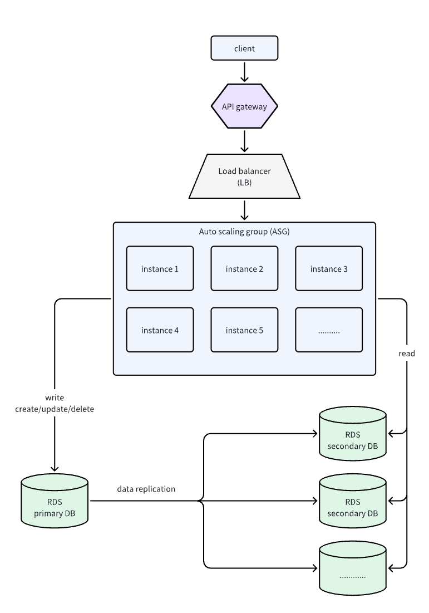

# Overview
AWS CDK is official toolkit in AWS that is designed for cloud engineers to create/update/manage/delete AWS cloud resources as a whole in a programmable approach. With CDK, we can easily deploy the cloud service infrastructure by simply define the resources we need and build connections between them. In this repo, we demonstrate how to build a general backend service infrastructure with API gateway, Load balancer, VPC, Auto Scaling Group, RDS, ECR, EventBridge and Lambda function. With this infrastructure setup, we solved the following problems:
1. create a proxy between client and backend service instance
2. auto scaling up/down backend service in auto scaling group using defined scaling rules
3. incoming traffic is evenly distributed to all available backend instances with load balancer
4. read and write database operations are separated and could scaled independently with backend service
5. CI/CD is achieved with github action, ECR, EventBridge and Lambda function
6. new created instance will be auto initialized with launch script



# install brew on mac
1. install brew
```
/bin/bash -c "$(curl -fsSL https://raw.githubusercontent.com/Homebrew/install/HEAD/install.sh)"
```

2. add home brew to path 
```
echo 'eval "$(/opt/homebrew/bin/brew shellenv)"' >> ~/.zprofile
```
```
eval "$(/opt/homebrew/bin/brew shellenv)"
```

3. check brew instal successfully  
```
brew --version
```

# install aws cdk
1. install node
```
brew install node
```
2. verify node installation `node -v` and `npm -v`
3. install cdk 
```
npm install -g aws-cdk
```
4. check installation
```
cdk --version
```
# create user in aws account
1. create a cdk user
2. add proper permissions, including: AmazonEC2ContainerRegistryFullAccess, AmazonS3FullAccess, AWSCloudFormationFullAccess, IAMFullAccess
3. create a key and save key-secret pair to local
# install aws cli
1. 
```
brew install awscli
```
2. check installation
```
aws --version
```
3. configure aws using the key and secret created in last section
```
aws configure
```
# create virtual env for the cdk pkg
1. create env
```
python3 -m venv cdk_env
```
2. activate env
```
source cdk_env/bin/activate
```
3. install requirements
```
pip install -r requirements.txt
```
4. confirm the env is activated and is uing python under env folder
```
which python
```
```
pip list
```
5. after finish development, deactivate using 
```
deactivate
```
# create the stack using cdk
1. make sure the venv is activated
2. bootstrap
```
cdk bootstrap
```
then check the CDKToolkit stack is created in aws cloudformation

3. synthesize
```
cdk synth
```
this command will generate aws resources based on the stack defined in cdk repo, the result is saved in cdk.out folder
4. deploy
```
cdk deploy
```
5. verify the deployment
6. stack can be destroyed with
```
cdk destroy
```
# trouble shooting
1. if bootstrap fails, check permission, delete stack then retry